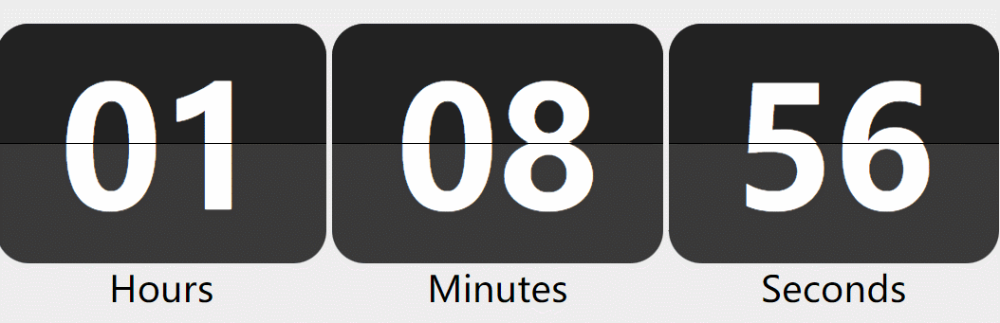

# 𝑭𝒍𝒊𝒑 𝑪𝒍𝒐𝒄𝒌

Reference from [WidgetStore](https://cn.widgetstore.net/#/detail/6d85a2b962c6cb270f16f0f63568ed50)

At the beginning of learning html, I was inspired by this component, so I tried to make a clock flip myself.

Preview in [https://taotxi.github.io/FlipClock/](https://taotxi.github.io/FlipClock/).

